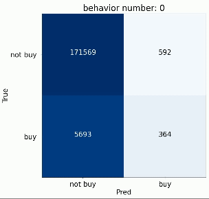
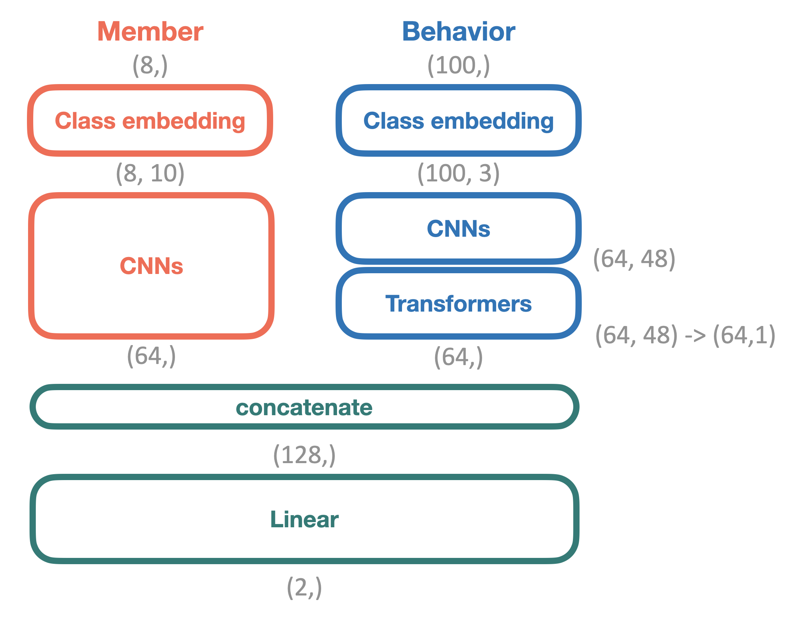

## Consumer Behavior Prediction Model

This project focuses on predicting consumer purchase behavior based on their browsing activity, allowing for more efficient ad budget allocation by targeting consumers likely to make a purchase.

### Research Objective:
The aim of this project is to forecast whether a consumer will make a purchase while they are still browsing, helping to allocate limited advertising resources to those most likely to convert.

### Demonstration

### Model Structure:
The model consists of two main parts:

1. **Consumer Membership Data**:
   - Registration Source
   - Member Center Code
   - Registration Time
   - Gender
   - Birthday

2. **Consumer Web Usage Behavior**:
   The model captures dynamic web behavior data, categorized into eight major types:
   1. **Register** (會員註冊, register)
   2. **PageView** (瀏覽頁面)
   3. **ViewProduct** (瀏覽商品頁, viewproduct)
   4. **Search** (搜尋, search)
   5. **AddToCart** (加入購物車, add)
   6. **Checkout** (開始結帳, checkout)
   7. **Purchase** (購買, purchase)
   8. **SelectContent** (點擊項目, selectcontent)

### Model Diagram:
Below is the visual representation of the model structure:

### Key Contributions:
- Utilization of both static membership information and dynamic web usage behavior for more accurate predictions.
- Predicting purchase behavior in real-time based on partial browsing data.
- Enabling more efficient ad spend by targeting consumers most likely to convert.

### Presentation:
For more details on the model and data structure, please refer to the [presentation file](docs/AI_8.pdf), which includes an in-depth explanation of the data and model implementation.
